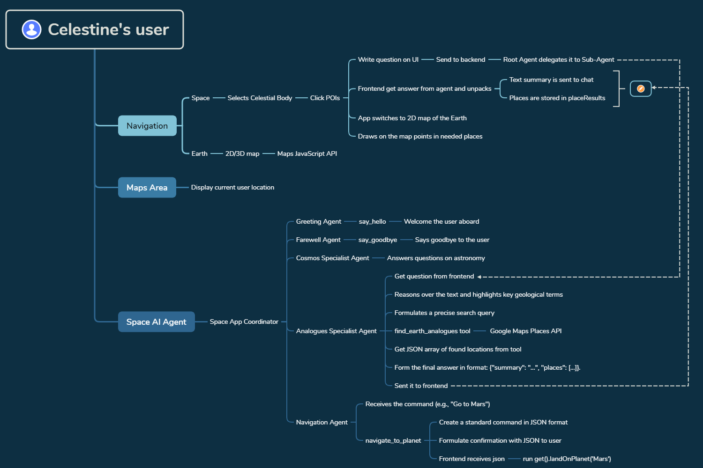

# Celestine: An Intelligent Navigator for the Universe 🚀 

     [](https://www.elevenlabs.io/) [](https://www.tavus.io/)

> **🏆 Nominee:** [Google Maps Platform Awards](https://devpost.com/software/celestine-rg16km)

> **🎥 Participant:** [DEV's Worldwide Show and Tell Challenge (Mux)](https://dev.to/vero-code/celestine-ai-navigator-for-the-universe-2acc)

## ⚡ Quick Demo


*(Full video walkthrough is available on [YouTube](https://youtu.be/4FixV3Uy2to))*

**Google Maps Platform** mastered the navigation of Earth. But what if we could extend that intuitive experience across the entire Solar System? 

Remember Google's "Space Mode"? It was a glimpse into a dream of cosmic exploration. Celestine revives that dream and gives it a mind. This project isn't just a map; it's an intelligent co-pilot designed to guide you through the cosmos, connecting alien worlds back to our own through AI-driven discovery. 

This project was developed for the **[Google Maps Platform Awards](https://devpost.com/software/celestine-rg16km)**.

## Core Innovation

The heart of Celestine is a sophisticated multi-agent system that uses **Google Maps Platform as a tool for reasoning**. 

When you click on a Point of Interest (POI) like the *Caloris Basin* on Mercury, the AI doesn't just recite facts. It understands the geological context ("impact basin"), independently decides to find real-world analogues, and then uses the **Places API** to search for locations like *Meteor Crater, Arizona*. The results, including coordinates, are then used to command the **Maps JavaScript API** to dynamically place markers on an interactive 2D map of Earth. 

This creates a seamless, intelligent loop: from a feature on another world to a real place you can explore on Google Maps. 
  
## 🏗️ Architecture

Below is the high-level architecture showing how the Multi-Agent System orchestrates Gemini, Google Maps, and the frontend.



## Features

- **3D Solar System Map:** Navigate a beautiful and interactive model of our solar system. 
- **Planetary Landings:** "Land on" planets to explore high-resolution 2D surface maps. 
- **Multi-Modal AI Agent:** Engage with your AI guide via: 
	- **Text Chat:** A sleek, modern chat interface. 
	- **Voice Synthesis:** Agent responses are voiced by **ElevenLabs**. 
	- **Video Avatar:** Have a real-time video conversation with a **Tavus** AI replica. 
- **Intelligent Navigation & Discovery:** 
	- Command the agent to fly you to any planet (`"Go to Mars"`). 
	- Discover terrestrial analogues for cosmic features, displayed dynamically on a **2D Google Map**. 
- **Immersive Visuals:** A stunning starfield background and detailed planet textures from NASA create a captivating experience.

## Technologies

| Area | Technologies |
|--|--|
| **Frontend** | `React`, `Vite`, `react-three-fiber`, `drei`, `zustand` |
| **Backend** | `Python`, `FastAPI`, `Uvicorn` |
| **AI** | `Google Agent Development Kit (ADK)`, `Gemini 2.5 Pro & Flash`, `ElevenLabs API`, `Tavus API` |
|**Mapping** | `Google Maps Platform` (`Maps JavaScript API`, [`Places API`](https://developers.google.com/maps/documentation/places/web-service)) |
| **Cloud & DevOps** | `Firebase Hosting`, `Google Cloud Run`, `Cloud Build`, `Artifact Registry`, `Secret Manager`, `Docker` |

## Installation

To run the project locally, you'll need to set up both the frontend and backend.

**Prerequisites:** 
- Node.js and npm 
- Python 3.11+ and pip 
- API keys for Google Maps, Gemini, ElevenLabs, and Tavus.

**1. Clone the repository:** 
```bash
git clone https://github.com/vero-code/celestine.git 
cd celestine
```

**2. Backend Setup:**

```bash
cd backend
python -m venv .venv
# Activate the virtual environment
.venv\Scripts\Activate.ps1 # PowerShell
source .venv/bin/activate  # Bash/Mac
pip install -r requirements.txt
# Create a .env file in the root directory and add your API keys
uvicorn main:app --reload --port 8000  
```

> To run Google Agent, enter the `adk web` command for other port (--port 8080).  

**3. Frontend Setup:**

```bash
cd ../frontend
npm install
# Create a .env file and add VITE_API_URL and your Google Maps key
npm run dev
```

## Testing

Coordinator analyzes the intent and passes the task to the specialized agent.
You can test the full range of the agent's capabilities through the UI.  

### **Via the Chat Interface:**

- **Greeting/Farewell:**

>  `Hi, my name is Leo.`

>  `Bye, see you soon!`

- **General Knowledge (Cosmos Agent):**

>  `How are black holes formed?`

- **Navigation (Navigation Agent):**

>  `Go to Moon.`

### **Via UI Interaction:**

- **Analogue Search (Analogues Agent):**

1. Navigate to the 3D space map.

2. Click on a planet (e.g., Mars).

3. In the info box, click "🚀 Land on".

4. On the 2D surface map, click on a POI pin (e.g., "Olympus Mons").

5. Observe the agent's response and the automatic switch to the 2D Earth map with markers.

- **Video Conversation (Tavus):**

1. In the chat panel, click the video camera icon (📹).

2. A modal window will open to start the video conversation.

## Limitations

- **API Quotas:** The voice synthesis (ElevenLabs) and video avatar (Tavus) features rely on free-tier API plans. They may stop working if usage limits are exceeded.

- **Voice Latency:** Generating voice for longer agent responses may take a few extra seconds.

## Data Sources

All planetary surface textures are courtesy of [NASA](https://science.nasa.gov) and available through their public science image galleries.  

>  **Note on Terminology:** For code simplification, the term "planet" is used broadly to refer to all celestial bodies (including the Sun and Moon) for implementation convenience.

## License
  
This project is licensed under the MIT License. See the `LICENSE` file for details.